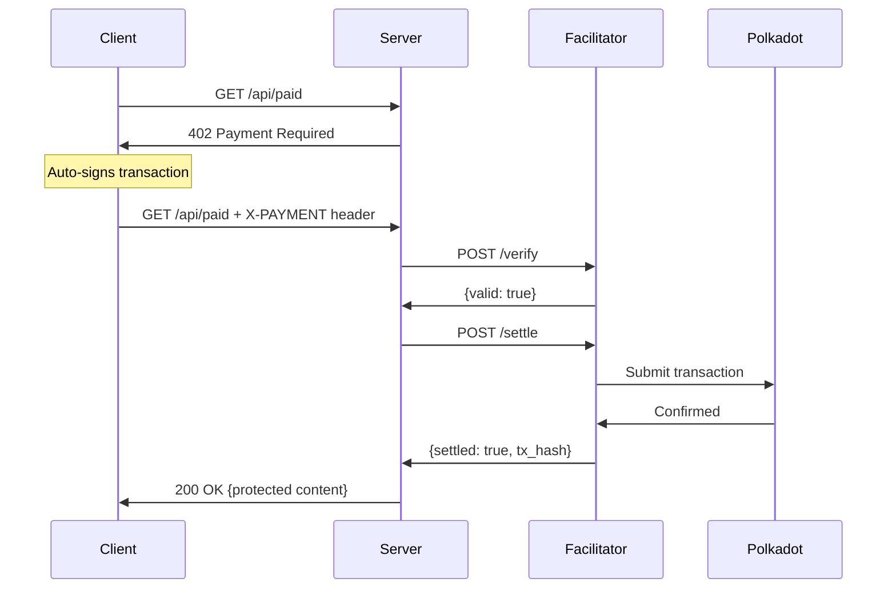

# x402 Polkadot Payment System (Demo)

A demo implementation of the x402 payment protocol for Polkadot.

## Payment Flow



## Live Demo


| Service | URL |
|---------|-----|
| Client | https://x402-client.fly.dev |
| Server | https://server-bold-dream-4447.fly.dev |
| Facilitator | https://facilitator.fly.dev |

## Quick Start

### Prerequisites

- Rust 1.70+
- Node.js 18+
- Wallet mnemonic (12-word phrase)
- Paseo testnet tokens from [Faucet](https://faucet.polkadot.io/)

### 1. Start Facilitator

```bash
cd facilitator
cp .env.example .env
cargo run
```

### 2. Start Server

```bash
cd server
cp .env.example .env
cargo run
```

### 3. Start Client

```bash
cd client
cp .env.example .env
npm install && npm run dev
```

### 4. Test Payment Flow

1. Open `http://localhost:5173`
2. Click "Load Wallet from .env"
3. Click "Test /api/paid"
4. Watch the payment flow complete automatically

## Project Structure

```
x402-polkadot/
├── client/       # Frontend (Vite + JS)
├── server/       # API server (Rust + Axum)
├── facilitator/  # Transaction service (Rust + Subxt)
```

## Resources

- [x402 Protocol](https://x402.org)
- [Paseo Faucet](https://faucet.polkadot.io/)
- [Paseo Explorer](https://paseo.subscan.io/)
