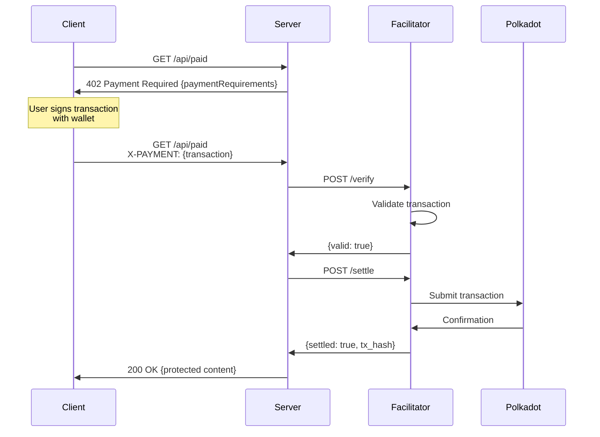

# x402 Polkadot Payment System

A complete implementation of the x402 payment protocol for Polkadot, consisting of three separate services: Client (Frontend), Server (Backend), and Facilitator.

## Overview

This project enables developers to accept DOT payments for API access using the x402 payment protocol on Polkadot.

```
┌─────────┐      ┌─────────┐      ┌──────────────┐      ┌──────────┐
│ Client  │─────>│ Server  │─────>│ Facilitator  │─────>│ Polkadot │
│ (5173)  │      │ (3000)  │      │    (8080)    │      │ Network  │
└─────────┘      └─────────┘      └──────────────┘      └──────────┘
```

## Architecture

### Client (Frontend)
- **Technology**: Vanilla JavaScript + Vite
- **Port**: 5173
- **Purpose**: User interface for wallet connection and payment
- **Features**: Polkadot.js wallet integration, payment UI, activity logs

### Server (Backend)
- **Technology**: Rust + Axum
- **Port**: 3000
- **Purpose**: API server implementing x402 protocol
- **Features**: Payment verification, facilitator client, protected endpoints

### Facilitator (Service)
- **Technology**: Rust + Axum + Subxt
- **Port**: 8080
- **Purpose**: Transaction validation and submission to Polkadot
- **Features**: Transaction verification, blockchain submission, payment settlement

## Payment Flow



## Quick Start

### Prerequisites

- Rust 1.70+ (`rustup`)
- Node.js 18+ (`node`, `npm`)
- Polkadot.js browser extension
- Westend testnet account with tokens

### 1. Clone & Setup

```bash
cd x402-polkadot
```

### 2. Start Facilitator

```bash
cd facilitator
cp .env.example .env
# Edit .env and configure settings
cargo run
```

Facilitator will start on `http://127.0.0.1:8080`

### 3. Start Server

```bash
cd ../server
cp .env.example .env
# Edit .env and set RECEIVER_WALLET_ADDRESS
cargo run
```

Server will start on `http://127.0.0.1:3000`

### 4. Start Client

```bash
cd ../client
cp .env.example .env
npm install
npm run dev
```

Client will start on `http://localhost:5173`

### 5. Test Payment Flow

1. Open browser to `http://localhost:5173`
2. Click "Connect Wallet"
3. Authorize Polkadot.js extension
4. Click "Test /api/paid"
5. See 402 Payment Required response
6. Click "Sign & Pay"
7. Sign transaction in wallet
8. Receive protected content

## Project Structure

```
x402-polkadot/
├── facilitator/          # Transaction facilitator service
│   ├── src/
│   │   ├── main.rs
│   │   ├── config.rs
│   │   ├── error.rs
│   │   ├── api/          # API endpoints
│   │   └── polkadot/     # Polkadot integration
│   ├── Cargo.toml
│   └── README.md
├── server/               # Backend API server
│   ├── src/
│   │   ├── main.rs
│   │   ├── config.rs
│   │   ├── error.rs
│   │   ├── api/          # API routes
│   │   ├── x402/         # x402 protocol
│   │   └── facilitator/  # Facilitator client
│   ├── Cargo.toml
│   └── README.md
├── client/               # Frontend web app
│   ├── src/
│   │   ├── main.js
│   │   ├── styles/       # CSS files
│   │   ├── services/     # API & Wallet services
│   │   └── utils/        # Logger utility
│   ├── index.html
│   ├── package.json
│   └── README.md
├── PROJECT_PLAN.md       # Project plan document
├── TASKS.md              # Task breakdown
└── README.md             # This file
```

## Configuration

### Facilitator (.env)
```env
POLKADOT_NETWORK=westend
POLKADOT_RPC_URL=wss://westend-rpc.polkadot.io
FACILITATOR_HOST=127.0.0.1
FACILITATOR_PORT=8080
RUST_LOG=info,x402_polkadot_facilitator=debug
```

### Server (.env)
```env
SERVER_HOST=127.0.0.1
SERVER_PORT=3000
FACILITATOR_URL=http://127.0.0.1:8080
RECEIVER_WALLET_ADDRESS=5FHneW46xGXgs5mUiveU4sbTyGBzmstUspZC92UhjJM694ty
DEFAULT_PRICE=1000000000000
POLKADOT_NETWORK=westend
RUST_LOG=info,x402_polkadot_server=debug
```

### Client (.env)
```env
VITE_SERVER_URL=http://127.0.0.1:3000
VITE_POLKADOT_NETWORK=westend
```

## API Documentation

### Facilitator API

- `GET /health` - Health check
- `POST /verify` - Verify transaction
- `POST /settle` - Settle transaction

### Server API

- `GET /api/health` - Health check
- `GET /api/free` - Free endpoint (no payment)
- `GET /api/paid` - Paid endpoint (requires payment)

See individual README files for detailed API documentation.

## Development

### Code Style

- **Rust**: Clean modules, comprehensive error handling
- **JavaScript**: ES6 modules, service-oriented
- **CSS**: Separate file, BEM-like naming
- **Logging**: Structured logging throughout

### Testing

```bash
# Test facilitator
cd facilitator && cargo test

# Test server
cd server && cargo test

# Test client (manual)
Open http://localhost:5173 and test UI
```

## Networks

### Westend (Testnet) - Recommended for Development
- RPC: `wss://westend-rpc.polkadot.io`
- Faucet: https://faucet.polkadot.io/
- Explorer: https://westend.subscan.io/

### Polkadot (Mainnet) - Production
- RPC: `wss://rpc.polkadot.io`
- Explorer: https://polkadot.subscan.io/

## Security Considerations

- Never commit `.env` files
- Validate all transactions before settlement
- Use proper error handling
- Implement rate limiting in production
- Audit smart contracts if using custom pallets

## Roadmap

- [x] Basic x402 protocol implementation
- [x] Facilitator service with Subxt
- [x] Server with facilitator client
- [x] Frontend with Polkadot.js wallet
- [ ] Real Subxt blockchain integration
- [ ] AssetHub USDT support
- [ ] Transaction caching
- [ ] Rate limiting
- [ ] Docker deployment
- [ ] Production deployment guide

## Resources

- [x402 Protocol](https://x402.org)
- [Polkadot Documentation](https://docs.polkadot.network/)
- [Subxt Documentation](https://docs.rs/subxt/)
- [Polkadot.js Extension](https://polkadot.js.org/extension/)

## Contributing

Contributions welcome! Please:
1. Read the code style guide
2. Write tests for new features
3. Update documentation
4. Submit pull requests

## License

MIT License - see LICENSE file for details

## Authors

- Built with ♥️ for the Polkadot ecosystem
- Following x402 payment protocol specification

## Support

For issues and questions:
- Check individual component READMEs
- Review PROJECT_PLAN.md and TASKS.md
- Open an issue on GitHub

---

**Status**: ✅ Development Complete - Ready for Subxt Integration
